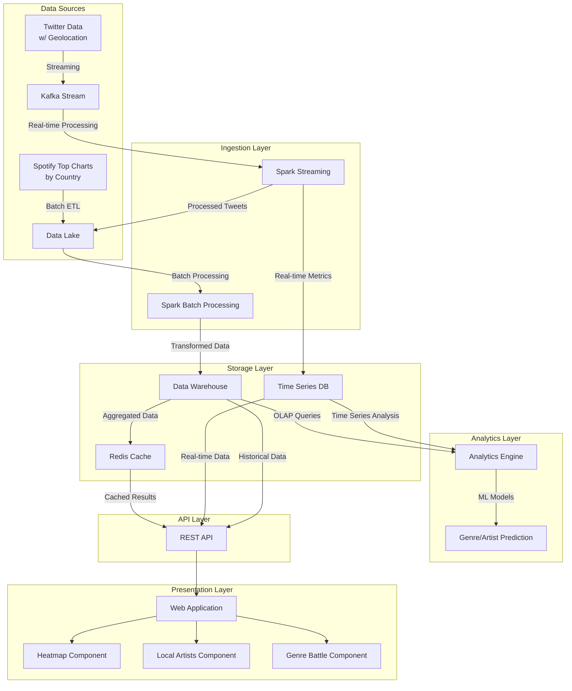

# Local Vibes – Music Trends by City  
**Big Data Architecture Project**  
*Streaming + Batch Processing + Real-Time Dashboarding*  

---

## 📌 Project Overview  
**Goal**: Compare musical tastes and listening habits across cities/countries by analyzing **Twitter (streaming) + Spotify (batch) data**.  

**Key Features**:  
- Real-time heatmap of trending genres per city.  
- Identification of local artists gaining traction.  
- "Genre battle" visualization (e.g., Pop vs. Rap vs. Rock).  

---

## 🛠️ Step 1: Foundational Setup  
## 📊 Data Pipeline

Our data pipeline consists of two main flows:

### Twitter Data Flow (Streaming)
1. Capture tweets with geolocation and music-related content
2. Process through Kafka streams
3. Analyze in real-time with Spark Streaming
4. Enrich with geographical and music metadata
5. Store in time-series and data warehouse

### Spotify Data Flow (Batch)
1. Daily extraction of top charts by country
2. Process and transform with Spark batch jobs
3. Join with Twitter data for enhanced insights
4. Generate aggregated metrics and trends
5. Update dashboard visualizations
---

### 2. **Target Architecture**  

---

### 3. **Tasks for Next Session**  
1. **Set Up Data Pipelines**:  
   - [ ] Twitter: Test API access and stream sample tweets to a Kafka topic.  
   - [ ] Spotify: Download a Kaggle dataset (e.g., [Spotify Top 200 Charts](https://www.kaggle.com/datasets/yelexa/spotify200)).  
2. **Infrastructure**:  
   - [ ] Deploy Kafka locally (Docker: `confluentinc/cp-kafka`).  
   - [ ] Prototype Spark Streaming (PySpark) to read from Kafka.  
3. **Schema Design**:  
   - Draft database tables (e.g., `tweets(ts, city, artist, genre)`, `spotify_charts(country, artist, rank)`).  

---

## 🚀 Next Steps  
- **Data Enrichment**: Use Spotify’s API to map artists to genres.  
- **Joins**: Combine batch (Spotify) + streaming (Twitter) for insights like:  
  *"In Paris, 60% of tweeted artists are local vs. 30% in global Spotify charts."*  

---

## 📚 Resources  
- [Twitter API Docs](https://developer.twitter.com/en/docs/twitter-api)  
- [Kafka + Spark Streaming Guide](https://spark.apache.org/docs/latest/streaming-kafka-integration.html)  
- [Sample Spotify Dataset](https://www.kaggle.com/datasets/yelexa/spotify200)  

---

**Team**: Arij Thabet, Mohamed Saber Azzaouzi, Mohamed Hannachi, Skander Tebourbi (13)

--- 

*Appendices*:  
- For troubleshooting Kafka, see [this guide](link).  

