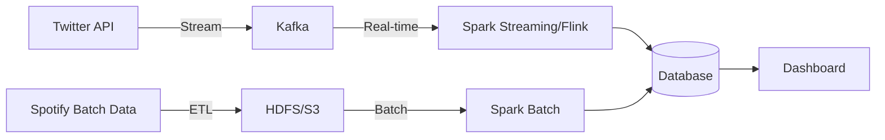

# Local Vibes – Music Trends by City  
**Big Data Architecture Project**  
*Streaming + Batch Processing + Real-Time Dashboarding*  

---

## 📌 Project Overview  
**Goal**: Compare musical tastes and listening habits across cities/countries by analyzing **Twitter (streaming) + Spotify (batch) data**.  

**Key Features**:  
- Real-time heatmap of trending genres per city.  
- Identification of local artists gaining traction.  
- "Genre battle" visualization (e.g., Pop vs. Rap vs. Rock).  

---

## 🛠️ Step 1: Foundational Setup  
### 1. **Data Sources**  
#### Streaming: **Twitter API**  
- **Why?** Tweets with geolocation provide real-time insights into music discussions.  
- **Fields to Extract**:  
  - Tweet text (e.g., "Listening to [song] by [artist]").  
  - Geolocation (city/country).  
  - Timestamp.  
- **Tools**:  
  - `tweepy` (Python) or `Twitter4J` (Java) to stream tweets.  
  - Filter keywords: `#NowPlaying`, "listening to", "spotify", etc.  

#### Batch: **Spotify Top Charts**  
- **Why?** Baseline data for comparing trends across regions.  
- **Sources**:  
  - [Spotify Charts (API)](https://spotifycharts.com/) or [Kaggle datasets](https://www.kaggle.com/datasets).  
- **Fields to Extract**:  
  - Top 50 songs/artists per country.  
  - Genres (from Spotify’s artist metadata).  

---

### 2. **Target Architecture**  

#### Components:  
- **Ingestion**:  
  - **Kafka**: Buffers real-time tweets for scalable consumption.  
  - **HDFS/S3**: Stores historical Spotify data.  
- **Processing**:  
  - **Spark Streaming/Flink**: Cleans, enriches, and aggregates tweets (e.g., extract artist/genre).  
  - **Spark Batch**: Joins Spotify data with Twitter trends (e.g., "Is X artist trending on Twitter but missing on Spotify?").  
- **Storage**:  
  - **Database Options**:  
    - *Time-series*: InfluxDB (for dashboarding).  
    - *Analytical*: PostgreSQL or Cassandra (for joins).  
- **Visualization**:  
  - **Grafana**: Real-time dashboards with geo-maps.  
  - **Streamlit**: Customizable Python dashboard (e.g., genre battles).  

---

### 3. **Tasks for Next Session**  
1. **Set Up Data Pipelines**:  
   - [ ] Twitter: Test API access and stream sample tweets to a Kafka topic.  
   - [ ] Spotify: Download a Kaggle dataset (e.g., [Spotify Top 200 Charts](https://www.kaggle.com/datasets/yelexa/spotify200)).  
2. **Infrastructure**:  
   - [ ] Deploy Kafka locally (Docker: `confluentinc/cp-kafka`).  
   - [ ] Prototype Spark Streaming (PySpark) to read from Kafka.  
3. **Schema Design**:  
   - Draft database tables (e.g., `tweets(ts, city, artist, genre)`, `spotify_charts(country, artist, rank)`).  

---

## 🚀 Next Steps  
- **Data Enrichment**: Use Spotify’s API to map artists to genres.  
- **Joins**: Combine batch (Spotify) + streaming (Twitter) for insights like:  
  *"In Paris, 60% of tweeted artists are local vs. 30% in global Spotify charts."*  

---

## 📚 Resources  
- [Twitter API Docs](https://developer.twitter.com/en/docs/twitter-api)  
- [Kafka + Spark Streaming Guide](https://spark.apache.org/docs/latest/streaming-kafka-integration.html)  
- [Sample Spotify Dataset](https://www.kaggle.com/datasets/yelexa/spotify200)  

---

**Team**: Arij Thabet, Mohamed Saber Azzaouzi, Mohamed Hannachi  

--- 

*Appendices*:  
- For troubleshooting Kafka, see [this guide](link).  

